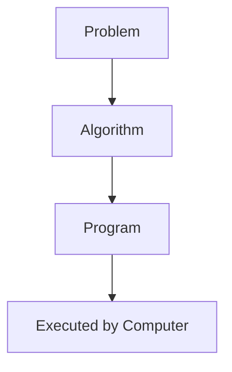

# Introduction to Programming

This document introduces key foundational concepts that will help you understand how programming works before you begin writing Python code. It covers what programming is, how computers interpret instructions, and how programming languages bridge the gap between humans and machines.

---

## 1. What Is Programming?

- Programming is the process of writing precise instructions (called programs) that a computer can execute to perform tasks or solve problems. These instructions are written using a programming language that defines a specific syntax and structure.
- Before writing code, programmers often begin by designing a logical plan or solution. This is called an **algorithm** (a step-by-step approach to solving a problem).Once the algorithm is clear, it can be implemented as a program in a specific language like Python.
- The purpose of programming is to automate processes, implement logic, and build software systems that operate consistently and efficiently. Programs can range from simple scripts to large-scale applications.

---

## 2. What Is an Algorithm?

An algorithm is a clearly defined sequence of steps used to solve a specific problem. It serves as the logical blueprint for a program.

Algorithms typically include:

- A defined starting point
- A sequence of operations or decisions
- A condition for completion

Once an algorithm is defined, it can be implemented using a programming language to create a functioning software solution.

---

## 3. What Is a Programming Language?

A programming language is a formal system of communication designed to express instructions to a computer. It provides a set of rules and syntax for writing logical operations, data handling, control structures, and more.

- Programming languages are generally categorized into two types:

---

### 1. Low-Level Languages

Low-level languages are closely aligned with the computer's hardware. They provide fine control over memory and performance but are harder to read and write. Examples include:

- Machine code (binary)
- Assembly language

### 2. High-Level Languages

High-level languages are designed to be more readable and easier to work with. They abstract away many of the hardware-level details.

Examples include:

- Python
- Java
- C++
- R
- JavaScript

Python is considered a high-level language and is widely used across disciplines due to its simplicity and flexibility.

---

## 4. How Do Computers Run a Program?

Computers do not directly understand high-level code. Programs written in a high-level language must first be translated into machine code—the binary instructions that the computer's processor can execute.

- There are two common approaches to this translation:

### Compiled Languages

In compiled languages, such as C or Java, the source code is fully translated into machine code by a compiler before execution. This produces an executable file that can run independently of the original source code.

### Interpreted Languages

In interpreted languages like Python, the source code is read and executed line by line by an interpreter. This allows for faster development and easier debugging, though it may not match the raw performance of compiled languages.

---

## 5. History of Python

Python was created by **Guido van Rossum** in late 1989 at **CWI, Netherlands**, and released publicly in 1991. It was inspired by the limitations of the ABC language, which lacked extensibility. Van Rossum aimed to develop a general-purpose language that was simple, powerful, and suitable for automating system tasks. Although initially influenced by the **Amoeba distributed OS**, Python was designed to be broadly applicable, with an emphasis on readability and flexibility.

---

## 6. Why Learn Python?

Python has become one of the most widely used programming languages across industries due to its simplicity, versatility, and robust ecosystem.

Reasons to learn Python include:

- Python uses **dynamic typing**, which means you don’t need to declare variable types explicitly. The interpreter figures out the type of a variable at runtime. This makes the language easier to learn and more flexible.
- Its syntax is concise and readable, which accelerates learning and reduces development errors.
- It supports a wide range of programming styles, including procedural, object-oriented, and functional programming.
- Python has strong support for automation, scripting, data analysis, artificial intelligence, and web development.
- It offers access to a broad set of libraries and frameworks for building everything from small utilities to large-scale applications.
- Python benefits from a large, active community and extensive online resources.
