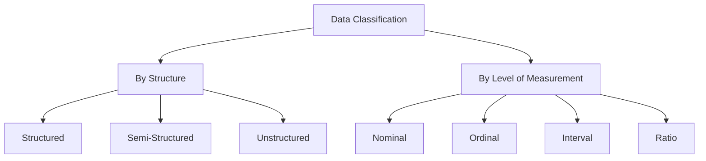

# Understanding Data

## What is Data?

- **Data** is a collection of raw facts, values, or observations that represent characteristics of people, events, or objects. It can be qualitative (descriptive) or quantitative (numeric), and it becomes meaningful only when organized, processed, and interpreted.
- It is factual information—such as measurements, counts, or statistics—used as a basis for reasoning, discussion, or calculation.

Before we begin working with data analysis tools and techniques, it is important to establish a clear understanding of what data is, how it is organized, and how it is measured. This document outlines two fundamental ways to classify data: by format (structure) and by level of measurement.

---

## 1. Data by Structure (Format)

This classification refers to how data is stored, organized, and accessed. It determines the nature of the system or tools used to manage and process the data.

### Structured Data

- Data that is organized into rows and columns (tabular format).
- Easily stored in relational databases or spreadsheets.
- Examples: CSV files, Excel sheets, SQL tables.

### Semi-Structured Data

- Data that has some organizational properties but does not fit neatly into a tabular schema.
- Often uses tags or keys to define hierarchy and structure.
- Examples: JSON files, XML documents, logs.

### Unstructured Data

- Data without a predefined schema or structure.
- Typically more difficult to analyze using conventional tabular tools.
- Examples: Text documents, images, audio, video.

Note: These categories refer to the format of the dataset as a whole and not to the properties of individual variables or values.

---

### Visual Overview

---

## 2. Data by Level of Measurement (Statistical Scale)

This classification refers to how individual data values can be interpreted and used in analysis. It helps determine which operations, comparisons, and visualizations are appropriate.

### Nominal Data

- Categorical data with no inherent order.
- Examples: Gender, Country, Blood Type.
- Operations: Equality/inequality checks only.

### Ordinal Data

- Categorical data with a logical order, but no defined spacing between values.
- Examples: Satisfaction levels (Low, Medium, High), Education levels.
- Operations: Comparisons like greater/less than are meaningful, but arithmetic is not.

### Interval Data

- Numeric data with equal spacing between values, but no true zero point.
- Examples: Temperature in Celsius or Fahrenheit, Dates on a calendar.
- Operations: Addition and subtraction are valid; ratios are not.

### Ratio Data

- Numeric data with a true zero, supporting the full range of arithmetic operations.
- Examples: Height, Weight, Age, Income.
- Operations: All mathematical operations are valid, including multiplication and division.

Note: These scales apply to individual variables within a dataset, regardless of whether the dataset is structured, semi-structured, or unstructured.

---

## Summary

There are two parallel ways to describe and classify data:

- **By structure**: Defines how the dataset is organized (structured, semi-structured, unstructured).
- **By measurement level**: Defines how individual values within the dataset can be interpreted and analyzed (nominal, ordinal, interval, ratio).

Understanding both perspectives is essential for choosing appropriate tools, transformations, and analytical methods during a data analysis workflow.

---
